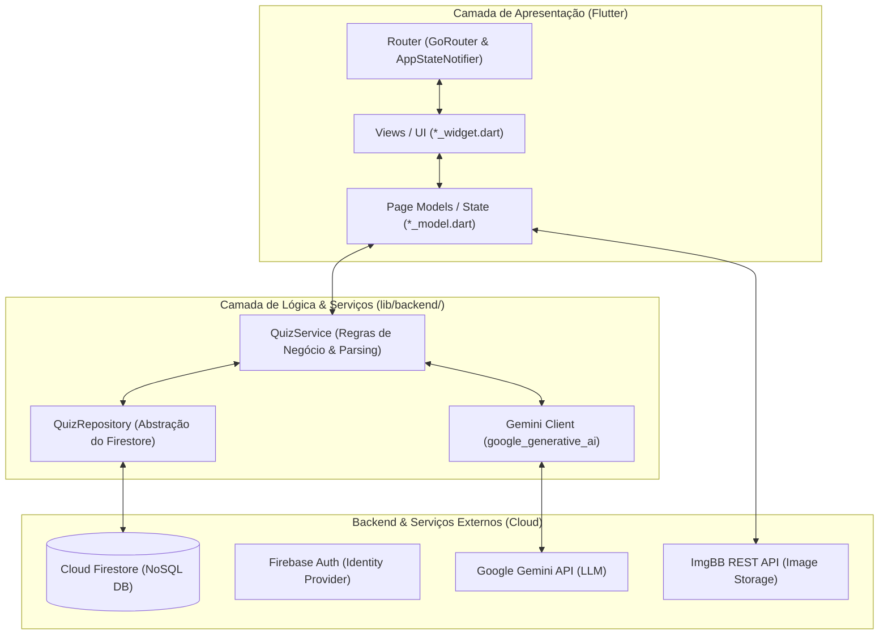

---

## 1. RESUMO EXECUTIVO DO PROJETO

### O que é o DesafIA?
O **DesafIA** é uma aplicação mobile desenvolvida em **Flutter**, que permite aos utilizadores criar, participar e rever quizzes educativos gerados automaticamente por **Inteligência Artificial (Google Gemini)** a partir de simples prompts em linguagem natural.

### Principais Funcionalidades:
- **Criação de Quizzes via IA**: Introdução de um tema e número de perguntas (ex: *"História de Portugal 10"*) para gerar automaticamente perguntas e opções estruturadas em Português (pt-pt).
- **Autenticação de Utilizadores**: Login tradicional (Email/Password) e Google via Firebase Auth.
- **Participação e Resolução**: Modos interativos de resposta a quizzes com temporizador e cálculo de pontuação instantâneo.
- **Gestão de Quizzes do Utilizador**: Edição de quizzes, personalização de perguntas, upload de imagens de capa e publicação pública/privada.
- **Revisão e Estatísticas**: Ecrãs detalhados com feedback sobre respostas corretas/incorretas.

---

## 2. ARQUITETURA DE SOFTWARE E PADRÕES DE DESIGN

O projeto adota uma arquitetura **Serverless / BaaS (Backend-as-a-Service)** com separação clara de responsabilidades no cliente Flutter.



### Padrões de Design Utilizados:
1. **Model-View-Controller / Model-View (FlutterFlow Pattern)**:
   - **`*_widget.dart`**: Focado unicamente na árvore de widgets e renderização de interface.
   - **`*_model.dart`**: Focado no controlo de formulários (`TextEditingController`), gestão de estados locais, escuta de eventos e chamadas aos serviços.
2. **Repository Pattern (`QuizRepository`)**:
   - Encapsula as operações diretas no Cloud Firestore ([quiz_repository.dart](file:///home/rodrigov/HDD/dev/ai-quizz-app/lib/backend/quiz/quiz_repository.dart)).
   - Isola os widgets das especificidades de consultas e coleções da base de dados.
3. **Service Orchestrator Pattern (`QuizService`)**:
   - Centraliza o fluxo de criação ([quiz_service.dart](file:///home/rodrigov/HDD/dev/ai-quizz-app/lib/backend/quiz/quiz_service.dart)): validação de prompt $\rightarrow$ criação de rascunho $\rightarrow$ geração via LLM $\rightarrow$ parsing JSON $\rightarrow$ gravação persistente.
4. **Observer / Provider Pattern**:
   - `AppStateNotifier` ([nav.dart](file:///home/rodrigov/HDD/dev/ai-quizz-app/lib/flutter_flow/nav/nav.dart)) notifica o `GoRouter` sobre alterações no estado de autenticação em tempo real para redirecionamento automático de rotas.

---

## 3. STACK TECNOLÓGICO E JUSTIFICAÇÃO DAS ESCOLHAS

| Tecnologia | Função no Projeto | Porquê esta escolha? (Justificação para Entrevista) |
| :--- | :--- | :--- |
| **Flutter / Dart** | Framework Frontend | Permite progrmação em Mobile e já existia experiência. |
| **Firebase Firestore** | Base de Dados NoSQL | Modelo de documentos flexível, fácil sincronização em tempo real via *Streams/Snapshots*, escala automática e sem necessidade de gestão de servidores. |
| **Firebase Auth** | Autenticação | Solução segura e pronta a usar para gerir sessões, tokens JWT e múltiplos provedores de login social (Google). |
| **Google Gemini 2.5 Flash** | Modelo de Linguagem (IA) | Modelo de LLM com baixíssima latência, excelente seguimento de instruções para devolução de JSON estruturado em PT-PT e integração simples via SDK `google_generative_ai`. |
| **GoRouter** | Roteamento Declarativo  navegação da app redirecionamentos dinâmicos (*route guards*) baseados no estado de auth. |
| **ImgBB REST API** | Alojamento de Imagens | Permite o upload rápido de fotos de perfil e capas de quizzes via requisições HTTP multipart simples sem encarecer o armazenamento no Firebase. |

---

## 4. ESTRUTURA DA BASE DE DADOS (CLOUD FIRESTORE)

A base de dados é organizada de forma hierárquica usando Coleções e Subcoleções NoSQL:

### Coleção Principal: `quizzes`
- `ownerUid` (String): UID do utilizador criador do quiz.
- `title` (String): Título/Tema do quiz.
- `topic` (String): Tópico específico.
- `requestedQuestionCount` (int): Quantidade de perguntas solicitadas.
- `questionCount` (int): Quantidade de perguntas efetivamente geradas e guardadas.
- `isPublic` (bool): Visibilidade do quiz na plataforma.
- `status` (String): Estado do quiz (`'draft'` durante a geração por IA, `'ready'` quando concluído).
- `sourcePrompt` (String): Prompt original fornecido pelo utilizador.
- `createdAt` (Timestamp): Data de criação (`FieldValue.serverTimestamp()`).
- `updatedAt` (Timestamp): Data da última atualização.

### Subcoleção: `quizzes/{quizId}/questions`
- `question` (String): Texto da pergunta em Português.
- `options` (List<String>): Array com 2 ou 4 opções de resposta.
- `correctAnswerIndex` (int): Índice da opção correta (0 a 3).
- `createdAt` (Timestamp): Data de inserção da pergunta.

---

## 5. ANÁLISE DETALHADA DOS FLUXOS CRÍTICOS DE CÓDIGO

### A. Fluxo de Geração de Quiz com IA (`QuizService` + `Gemini` + `QuizRepository`)
O fluxo completo ocorre no ficheiro [quiz_service.dart](file:///home/rodrigov/HDD/dev/ai-quizz-app/lib/backend/quiz/quiz_service.dart#L48):

1. **Validação do Prompt**:
   ```dart
   final parsed = parsePrompt(prompt); // Extrai tema e contagem (ex: "Historia 10")
   ```
2. **Criação de Documento Rascunho no Firestore**:
   ```dart
   final quizId = await _repository.createQuiz(... status: 'draft' ...);
   ```
3. **Invocação do Gemini LLM**:
   ```dart
   final aiPrompt = '''
   Cria um quiz sobre o tema "${parsed.topic}" com ${parsed.questionCount} perguntas de escolha múltipla...
   Devolve APENAS um array JSON válido de objetos...
   ''';
   final aiResponse = await geminiGenerateText(context, aiPrompt);
   ```
4. **Sanitização e Parsing de JSON**:
   ```dart
   String cleanJson = aiResponse.trim();
   if (cleanJson.startsWith('```json')) cleanJson = cleanJson.substring(7);
   if (cleanJson.endsWith('```')) cleanJson = cleanJson.substring(0, cleanJson.length - 3);
   final List<dynamic> parsedData = jsonDecode(cleanJson.trim());
   ```
5. **Gravação em Lote (Batch Commit)**:
   ```dart
   await _repository.saveQuestions(quizId, questions); // Grava perguntas e altera status para 'ready'
   ```

### B. Fluxo de Autenticação e Guarda de Rotas (`GoRouter`)
No ficheiro [nav.dart](file:///home/rodrigov/HDD/dev/ai-quizz-app/lib/flutter_flow/nav/nav.dart):
- O `AppStateNotifier` escuta as mudanças no `FirebaseAuth.instance.authStateChanges()`.
- Se o utilizador tentar aceder a uma rota protegida (como `/addQuiz` ou `/editarPerfil`) sem estar autenticado, o `GoRouter` redireciona automaticamente para a `/landingPage` ou `/authentication`.

---

## 6. DESAFIOS TÉCNICOS ENFRENTADOS E SOLUÇÕES (CASOS REAIS)

Estes são pontos essenciais para mencionar numa entrevista, pois demonstram **capacidade de resolução de problemas práticos**:

### 1. Desafio: Formatação de Respostas da IA (Markdown Code Blocks)
- **Problema**: O modelo Gemini por vezes envolvia a resposta JSON em blocos de texto markdown (```json ... ```), provocando exceções no `jsonDecode`.
- **Solução**: Implementação de um algoritmo de sanitização de strings em [quiz_service.dart](file:///home/rodrigov/HDD/dev/ai-quizz-app/lib/backend/quiz/quiz_service.dart#L89) para stripping prévio de delimitadores markdown antes do parse.

### 2. Desafio: Erro de "Missing Composite Index" no Firebase Firestore
- **Problema**: Ao tentar ordenar os quizzes do utilizador com `.where('ownerUid', isEqualTo: ownerUid).orderBy('createdAt')`, o Firestore exigia a criação manual de índices compostos no console Firebase.
- **Solução**: Remoção da ordenação remota na query do Firestore ([quiz_repository.dart](file:///home/rodrigov/HDD/dev/ai-quizz-app/lib/backend/quiz/quiz_repository.dart#L69)) e aplicação da ordenação em memória no lado do cliente (Widget), reduzindo a dependência de índices compostos rígidos na nuvem.

### 3. Desafio: Segurança da Chave de API do Gemini
- **Problema**: Evitar expor a chave de API da IA diretamente no código-fonte do repositório Git.
- **Solução**: Utilização de `String.fromEnvironment('GEMINI_API_KEY')` em [gemini.dart](file:///home/rodrigov/HDD/dev/ai-quizz-app/lib/backend/gemini/gemini.dart#L8), permitindo injetar a chave em tempo de compilação/execução via `--dart-define`.


